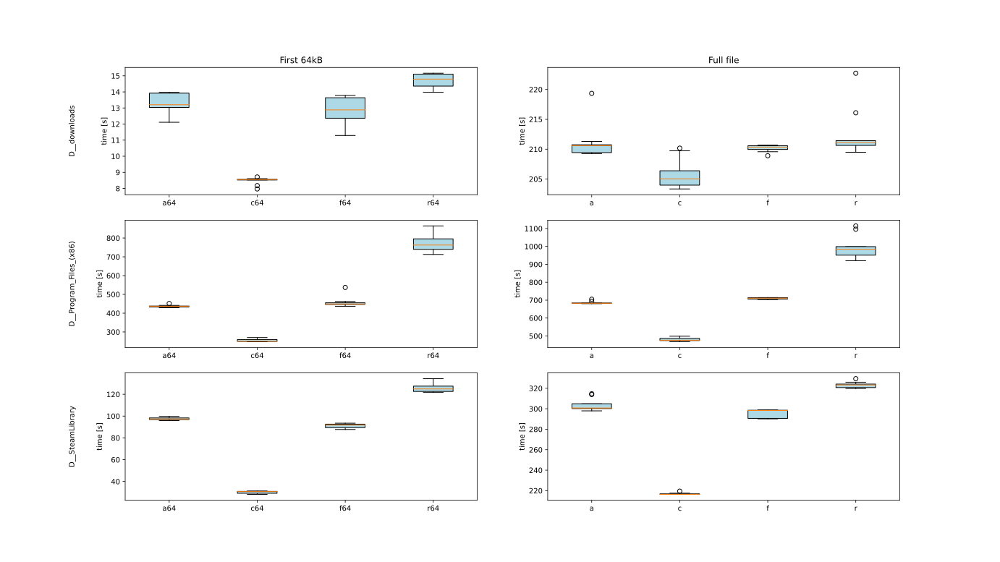

## IOBoost POC

This is a proof of concept for an acceleration of the iteration over files on a hard disk that I implemented in my free time while working on an anti-malware scanner on my job.

The idea is to process the files in the order as they are stored on the hard disk instead of doing this in the order as they are reported by the filesystem API. This leads to a reduction of the movements of the disk head of the HDD needed to read the file sectors and therefore to a reduction of the IO time it takes to process the files. In order to create such an ordered list of the files the Windows defragmentation API is used to find out the location of the first sector of each file on the disk and sort them accordingly.

In this POC a bogus hash is calculated over the first 64 kB[^1] of the file or the full file to simulate different usage scenarios. For some applications the entire file has to be read from disk, but for others only a small portion is required since only the file header, a data structure describing the format, and some of the data is used. In the case of an anti-malware scanner you'll typically want to avoid processing a lot of data in order to reduce the impact on the system performance, which roughly fits the 64 kB scenario.

For comparison several file iteration strategies have been implemented:

* Filesystem order: The default strategy that will be used by any program that only uses `FindFirstFile`/`FindNextFile`.
* Alphabetic order: A possible iteration strategy used by programs that store the paths to the files in a alphabetically sorted data structure which is processed after filling it.
* Cluster order: The approach proposed in this paper.
* Random order: Process the files in a random order to obtain a worst case reference for all possible file iteration strategies.

### Usage

Several tools have been implemented to investigate the approach proposed in this paper.

#### Executable

The syntax of the file iteration executable that can be built using the Visual Studio solution from the repository is as follows:

`FileIterator.exe <strategies> <folders>`

Here `strategies` can be one or more of the following file iteration strategies, where the appended 64 always refers to the first 64 kB of a file as opposed to the full file that is processed if this suffix is omitted:

- -a or -a64: Alphabetic order
- -r or -r64: Random order
- -f or -f64: Filesystem order
- -c or -c64: Cluster order

In `folders` the folders have to be specified that will be processed recursively.

Output example:

`.\FileIterator.exe -f64 D:\downloads
obtaining files took 1.6147s
hashing 1038 files (filesystem order, 64k) took 33.0187s`

`.\FileIterator.exe -c64 D:\downloads
obtaining files took 0.0267412s
hashing 1038 files (cluster order, 64k) took 22.2432s`

#### Scripts

The repository also contains scripts for conducting performance tests, `performance_test.py` and `summary.py`. 

`performance_test.py` accepts the same arguments as the executable and some additional parameters on top:

`performance_test.py [-count N] [-out folder] <strategies> <folders>`

The optional `-count N` defines the number of test repetitions for each combination of folder and strategy, defaulting to `1`.
The optional `-out folder` defines the folder where the performance test results will be written, defaulting to `'out'`.

The script searches for the executable in the current working directory and the default 64bit release build folder so that it can be used easily from the repository or a dedicated folder for running the tests. It will process the folders provided, warming up the filesystem once by processing the files, followed by the actual test runs using the provided file iteration strategies. For each of the test runs the output of the executable is stored in a file in the output folder so that the performance can be analyzed later using `summary.py`. Before every test run the script makes sure that the files aren't cached in the RAM by emptying the standby list using [RAMMap](https://docs.microsoft.com/en-us/sysinternals/downloads/rammap). This is a Sysinternals tool that requires administrator privileges and can show how the RAM is used in the system and also can manipulate this to some extent. Here we use it to remove all pages of the mapped files from the standby list, so that the pages will be read again from the disk in the next read operation instead of just being mapped to the process. The tool has to be accessible from the python script, for example by adding the Sysinternals folder to the path environment variable.

`summary.py` accepts the following arguments:

`summary.py [-out name] [folder]`

The optional `folder` is the folder containing the performance test results to be summarized and by default matches the default output folder `'out'` of `performance_test.py`.
The optional `-out name` defines the base name of the summary files that will be written to the specified folder. Each of these will also have an additional suffix and file extension stating the kind of summary.

The script parses the performance test results from the given folder and creates scatter and box plots of the time required to read and process the file content as well as a statistical summary for each of the individual file iteration scenarios examined. The Python package [matplotlib](https://matplotlib.org/) is required for running the script. To allow for an easy comparison of the strategies the script also prints the average duration of the fastest strategy for each of the combinations of set of files and usage scenario as well as how much slower each of the other strategies was.

Output example:

`D__downloads:
fastest: c64, 8.46s
f64: 12.90s, 1.52x slower
a64: 13.29s, 1.57x slower
r64: 14.70s, 1.74x slower
fastest: c, 205.82s
f: 210.17s, 1.02x slower
a: 211.22s, 1.03x slower
r: 212.67s, 1.03x slower`

### Experiments

Several experiments have been conducted to evaluate the approach proposed in this paper.

#### Setup

Since the original raw data from 2015 was no longer available I conducted a new experiment using three sets of files with different characteristics:

| Set           |     Size | Number of files | Average file size |
| ------------- | -------: | --------------: | ----------------: |
| Downloads     | 20.06 GB |            1038 |          20260 kB |
| Steam Library | 21.71 GB |           13078 |           1740 kB |
| Program Files | 32.57 GB |           42863 |            796 kB |

For each of these sets all possible iteration strategies were evaluated using 9 runs in both usage scenarios.

The experiments were executed on a Ryzen 9 5950X with 32 GB of RAM and a 2 TB HDD of type WD20EARX. According to the Windows 10 defragmentation tool the disk wasn't fragmented.

#### Results

The following image shows a boxplot of the time required to process the data of all runs for each configuration:

We can see that despite the low number of runs we have obtained quite precise measurements with very few outliers.

The following table shows the average duration for each configuration:

| Set           | Strategy / Usage scenario | Duration | Slowdown |
| ------------- | ------------------------- | -------: | -------: |
| Downloads     | c64                       |   8.46 s |       1x |
|               | f64                       |  12.90 s |    1.52x |
|               | a64                       |  13.29 s |    1.57x |
|               | r64                       |  14.70 s |    1.74x |
| Downloads     | c                         | 205.82 s |       1x |
|               | f                         | 210.17 s |    1.02x |
|               | a                         | 211.22 s |    1.03x |
|               | r                         | 212.67 s |    1.03x |
| Steam Library | c64                       |  30.09 s |       1x |
|               | f64                       |  90.92 s |    3.02x |
|               | a64                       |  97.59 s |    3.24x |
|               | r64                       | 126.29 s |    4.20x |
| Steam Library | c                         | 216.94 s |       1x |
|               | f                         | 295.79 s |    1.36x |
|               | a                         | 303.63 s |    1.40x |
|               | r                         | 323.15 s |    1.49x |
| Program Files | c64                       | 255.58 s |       1x |
|               | a64                       | 436.93 s |    1.71x |
|               | f64                       | 458.94 s |    1.80x |
|               | r64                       | 768.33 s |    3.01x |
| Program Files | c                         | 479.97 s |       1x |
|               | a                         | 686.24 s |    1.43x |
|               | f                         | 710.04 s |    1.48x |
|               | r                         | 997.48 s |    2.08x |

The cluster strategy always performs best. In the worst case of very large files it still is 2% faster than the default iteration strategy and unsurprisingly performs better the smaller the files are, **up to three times faster** than the filesystem order in the 64 kB scenario and **up to 48% faster** in the full file scenario. The random strategy is always the worst choice and the alphabetical and filesystem strategies achieve very similar results.

Estimated lower and upper bounds can be established by assuming that the entire data is transferred with the [reported maximum sustained data transfer rate](https://products.wdc.com/library/SpecSheet/ENG/2879-701229.pdf) of 104.9 MB/s and that for each file we have to reposition the disk head in an estimated time of 20 ms. The latter is just a plausible value since no official specification could be found. Both the transfer rate and the seek duration will vary depending on where on the disk the data is located. The reading will be fastest from the outer disk sectors due to the disk rotation, while the seek duration heavily depends on the spatial proximity of the files on the disk. Also the disk might prefill its 64 MB buffer with data that potentially will be requested next. Therefore the theoretical minimum data transfer duration is a lower bound on the actual duration and adding the estimated seek duration only gives a rough idea of the maximum duration. Nevertheless let's have a look at the values for the full file scenario:

| Set           | Min. data transfer duration | Est. seek duration | Est. max. duration |
| ------------- | --------------------------: | -----------------: | -----------------: |
| Downloads     |                    196.77 s |            20.76 s |           216.53 s |
| Steam Library |                    211.94 s |           261.56 s |           475.35 s |
| Program Files |                    317.89 s |           857.26 s |          1175.15 s |

The processing of the downloads folder and the Steam library is already very close to the theoretical minimum, while processing the program files in the cluster order still leaves big room for improvement. The range between the minimum and the maximum duration expected for processing the downloads folder is not very big, which explains the small speedup by using the cluster strategy. In the case of the program files the random strategy is close to the estimated upper bound, which shows how much the processing time is affected by the seek duration if there are plenty of small files.

### Conclusion

The results are so promising that all programs processing large numbers of files should use the location of the files on the disk in order to speed things up. It would have been even better if operating systems had implemented this and provided an API that allows the files a program wants to process to be transferred to the operating system instead of relying on command queuing implemented in hard drives, which is only effective if the disk processes multiple requests at the same time. Even simple tasks like copying files should benefit from the proposed approach and give operating systems an advantage over competitors.

### Note

I share this project to demonstrate the typical work within the field of Algorithm Engineering and to share the idea of speeding up the file processing, albeit this doesn't have a big impact any longer due to the declining usage of HDDs. This is a POC and has been carried out within a short amount of time, so the code is far from production-ready. There's no consistent code style, no documentation, no unit test, but surely some bugs can be found :-).

In a real-world application there would be iterator classes as an abstraction layer to make the code easy to test and to adapt to the specific requirements. A batch processing would surely be found to reduce the amount of memory required to store the paths at a small performance penalty. Maybe it would even be beneficial to add a full file cluster optimization strategy using a PTAS for the underlying TSP-problem to speed up the processing of large fragmented files or many small files. Prefetching sectors of files that will be processed soon could also be an option.

[^1]: All sizes in this paper use base 2 prefixes, e.g. kB=2^10 bytes, MB=2^20 bytes, GB = 2^30 bytes, TB=2^40 bytes

